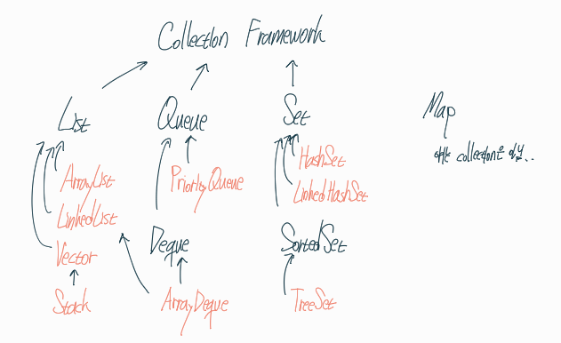

## Collection Framework란 무엇일까?

데이터 군을 다루고 표현하기 위한 단일화된 구조

## 이걸 왜 사용할까

컬렉션 프레임워크를 사용하면 몇가지 장점이 있다.

- `ArrayList`, `LinkedList`, `Stack`, `Queue`, `Map`, `Tree` ... 등 다양한 자료구조를 **우리가 직접 구현하지 않고 사용하기만 하면 되므로 편리**하다.
- **객체지향적인 설계**를 통해 표준화가 되어있어 재사용성, 편리성이 뛰어나다.

## 어떤게 있을까

정말 다양한 클래스들이 있다.

그중에서 핵심 `interface`을 꼽자면 `List`, `Queue`, `Set`, `Map`이 있다

그림을 통해 상속 다이어그램을 이해해보자

하나하나 살펴보자
